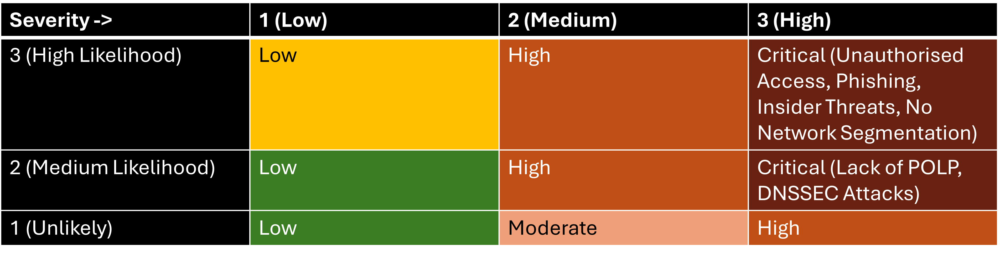
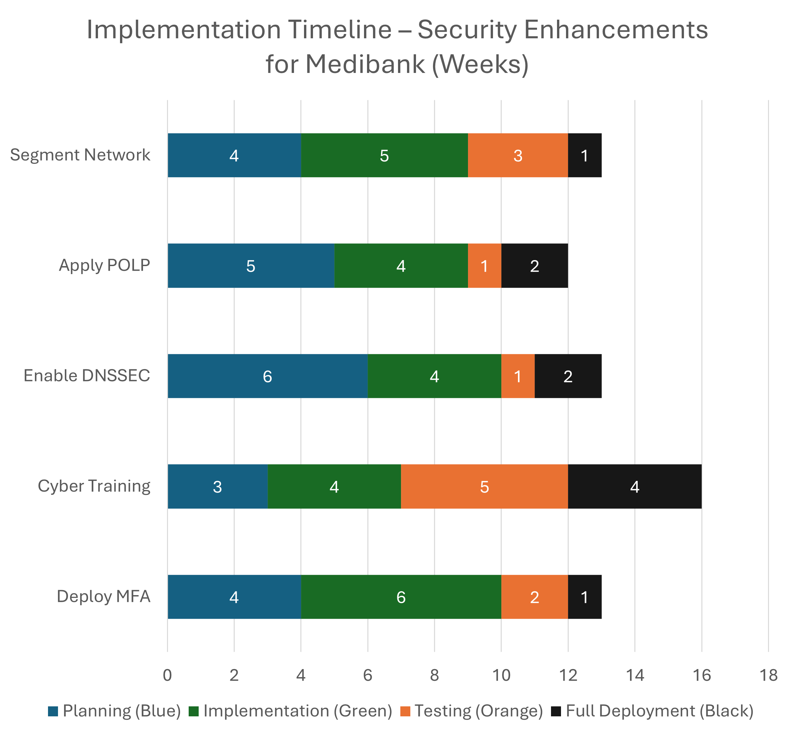

# Medibank Security Risk Assessment 🚀

## 📌 Overview
This project presents a **security risk assessment** for Medibank following its **2022 cyber breach**, with a structured **risk mitigation strategy** aligned with **ISO 27001, APRA CPS 234, and the Australian Privacy Act**.

The project includes:
✅ A **detailed risk register** identifying key security threats  
✅ **Mitigation strategies** to enhance Medibank’s security posture  
✅ A **Gantt chart** outlining a **realistic security implementation plan**  
✅ A **PowerPoint presentation** designed for **executive management**  
✅ A **video presentation** explaining findings & recommendations  

## 🔍 Key Findings
- **$50M+ in financial impact**, regulatory scrutiny, and reputational damage.
- Top **critical risks**: **Unauthorised access, phishing, insider threats, network weaknesses**.
- **Mitigation Plan:** MFA, least privilege access, cybersecurity training, network segmentation.

## 📂 Project Files
| 📂 File | 🔹 Description |
|---------|--------------|
| `Medibank_Security_Risk_Assessment_Report.pdf` | Full **consulting-style risk report** |
| `📊-Medibank_Risk_Register_Assessment.pdf` | **Risk matrix** with impact analysis |
| `Medibank_Gantt_Chart` | **Implementation timeline** for security improvements |
| `Medibank_Presentation.pdf` | **PowerPoint slides** (executive-friendly) |
| `Images/` | **Visuals: Risk heatmap, Gantt chart, executive summary** |

## 🎯 Key Security Recommendations
🔹 **Enforce Multi-Factor Authentication (MFA)** to prevent unauthorised access  
🔹 **Implement Cybersecurity Awareness Training** to mitigate phishing threats  
🔹 **Apply the Principle of Least Privilege (POLP)** to limit insider threats  
🔹 **Enable DNSSEC** to prevent website impersonation attacks  
🔹 **Segment the network** to contain lateral movement  

## 📊 Risk Heatmap Visualisation

## 📈 Project Timeline

## 🎤 Video Presentation
📽️ Watch the full risk assessment video presentation here: **[YouTube Link or GitHub Upload]**

---

## 📌 How to Use This Project
If you are interested in **GRC consulting, risk management, or cybersecurity governance**, this project provides a **real-world case study** of risk assessment and mitigation planning.

**Feel free to fork this repository, use it for learning, or reach out for feedback!**

🚀 **By Yasif Farook** | [LinkedIn Profile](https://www.linkedin.com/in/yasif-farook-ab991a22b/)
